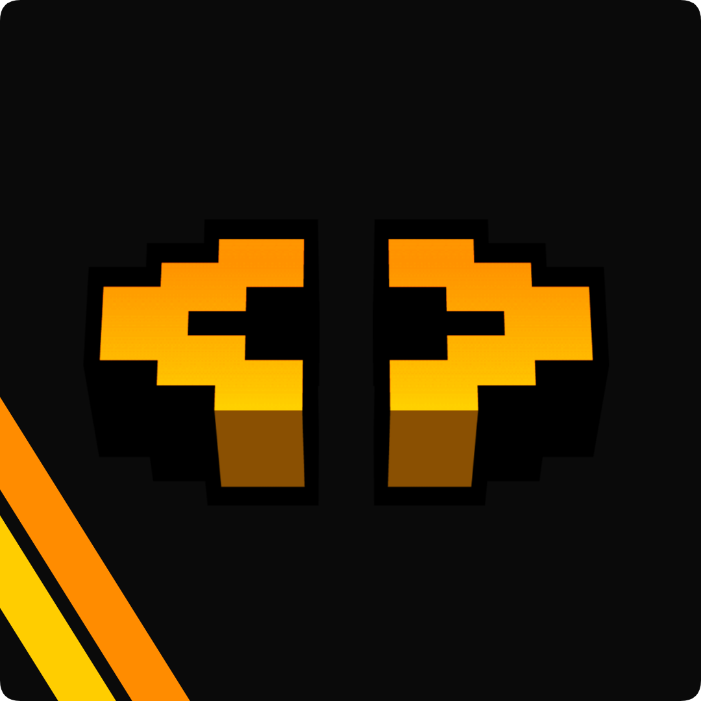

# AmbleLabs

### Our Team

- **Loqor** - Project Manager & Lead Frontend Developer:    
- **theoretically** - Lead Backend Developer:    
- **duzo** - Developer:    
- **Saturn** - Game Director, Sponsor & QA Lead: 
- **Addi3 (AddieDaBaddie)** - Developer, Artist:   
- **Monke** - Developer: 
- **Pan** - Developer: 
- **Lake** - Developer:  
- **Ouro** - Lead Art Director:  
- **Wazzaki** - Artist: 
- **Red Panda (Classic)** - Builder, Animator & Sound Designer: 
- **Dian** - Music & Sound Designer: 
- **Lucien** - Music: 
- **RatZoomie** - Music
- **Echo** - Wiki Curator:  
- **Tree** - Wiki Curator: 

### Thank You's

- Rhyno (Minecraft Server Host)
